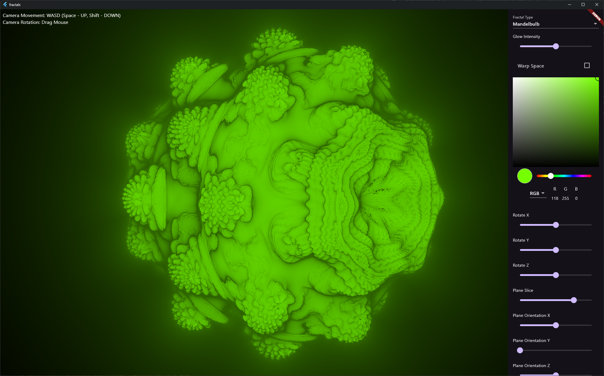
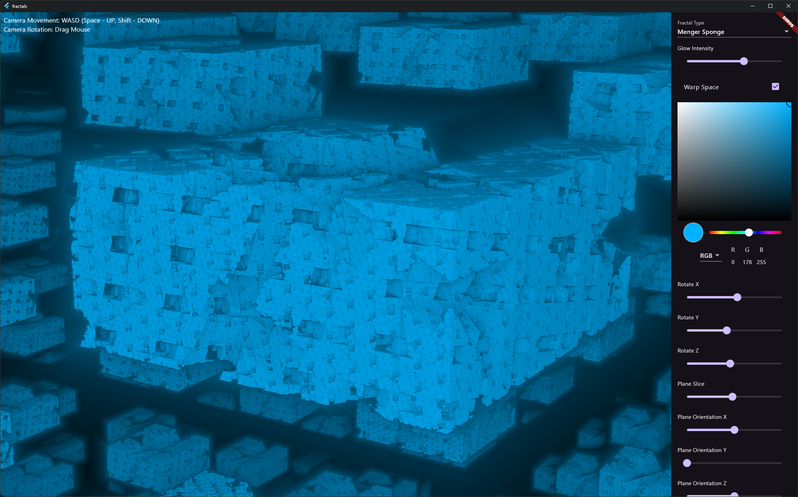

# fractals

A 3D Fractal Explorer written in Flutter.

Currently, the app supports the following fractals:

- Mandelbulb
- Menger Sponge

## Features

- [x] 3D Fractal Rendering
- [x] Camera Controls
- [x] Space rotation
- [x] Space warping
- [x] Glow effect
- [x] Fractal slicing using a plane

Features are largely limited due to current limits of the Flutter framework regarding custom shaders. (Hopefully, this will change in the future when Impeller is everywhere with Flutter GPU support).

## Screenshots





## Building

To build the app, you need to have Flutter installed. Then, you can run the following command:

```bash
flutter run
```
